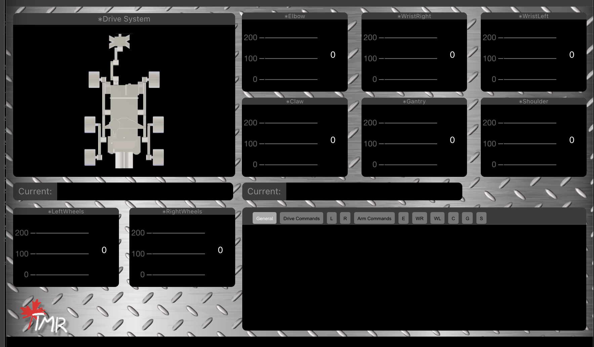

# Control System Task

This repository contains the code and documentation for a control system task involving a system that processes commands related to a drive system and arm components using WebSockets. The task involves parsing specific command structures to manage different parts of a robotic system.

## Screencapture



## Project Structure
The repository contains all project files inside the control-system-task folder. The key components include:


### WebSocket Command Parsing: 
The system receives and processes real-time commands via WebSockets to control drive and arm components.

### Drive System Commands: 
Commands starting with D_ manage the drive system of the robot.

### Arm System Commands: 
Commands starting with A_ manage arm components such as the elbow, wrist, claw, gantry, and shoulder.

### Part-1-task (Python Program): 
A Python program that connects to a PS4 controller using pygame, processes controller inputs, and outputs them in the required command structure (D_ or A_) using sockets and WebSockets.

### Part-2-option-A (React Web App): 
A React-based web app that receives WebSocket data from the part-1-task and visualizes the commands using Chart.js.


## Command Structure
The commands follow a structured format:

### Drive Commands:
D_128_128_128_128_128_128
Each segment represents a specific part of the drive system.

### Arm Commands:
A_128_128_128_128_128_128
Each segment represents a specific component of the arm.

The numbers represent different control values for each component. The system parses these commands in real-time to perform actions on the respective components.


## Features
Real-time WebSocket Integration: The project receives and handles commands in real-time.

PS4 Controller Input Processing: The Python program captures controller inputs and converts them to command structures.

Command Visualization: The React web app visualizes the received commands using Chart.js.

Modular Command Parsing: The system parses both drive and arm commands based on their respective structures.


##Installation
Clone the repository:
```bash
git clone https://github.com/Allenreinoso28/control-system-task.git
```

### Running the Python Program (Part-1-task)
Navigate to the part-1-task folder:

```bash
cd part-1-task
```
Install requirements if not already installed:

```bash
pip install -r requirements.txt
```
Run the Python program:

```bash
python app
or
python app_websocket
```
The program will detect inputs from the PS4 controller, process them, and output the corresponding command structure through sockets and WebSockets.

### Running the React Web App (Part-2-option-A)
Navigate to the part-2-option-A folder:

```bash
cd part-2-option-A
```
Install the necessary dependencies:

```bash
npm install
```
Run the React app:

```bash
npm start
```
The web app will receive WebSocket data from the part-1-task and visualize the commands using Chart.js.


## Technologies

JavaScript

React

Socket

WebSockets

Python

Pygame

Chart.js


## Usage

### Exit

PS Button: Exit

### Test Mode

Options: Toggle program sending packets

### Speed Modes

R3/L3: Toggle through preset list of speed changes [18, 36, 54, 72, 90, 108, 127]

L1: Holding enables throttle control (only one of Arm or Wrist Systems can be used at a time)

### Drive System

R Stick: Controls right set of wheels (forward/backward)

L Stick: Controls left set of wheels (forward/backward)

### Arm System

R2: Throttle select motor clockwise

L2: Throttle select motor counterclockwise

△: Holding selects gantry (R2 up / L2 down)

(circle)𐤏: Holding selects shoulder (R2 CW / L2

X: Holding selects elbow (R2 up / L2 down)

□: Holding selects claw (R2 open / L2 close)

### Wrist System

R2 (when holding L1): Throttle select wrist action

D-pad up: Move wrist up

D-pad down: Move wrist down

D-pad left: Spin wrist counterclockwise

D-pad right: Spin wrist clockwise

### Pygame Input Mapping
Playstation 4 Controller (Pygame 2.x)

The PlayStation 4 controller mapping has 6 axes and 16 buttons. The controller is recognized as "PS4 Controller."

####Left Stick:

Left -> Right: Axis 0

Up -> Down: Axis 1

####Right Stick:

Left -> Right: Axis 2

Up -> Down: Axis 3

#### Left Trigger:

Out -> In: Axis 4

#### Right Trigger:

Out -> In: Axis 5

#### Buttons:

Cross Button: Button 0

Circle Button: Button 1

Square Button: Button 2

Triangle Button: Button 3

Share Button: Button 4

PS Button: Button 5

Options Button: Button 6

L. Stick In: Button 7

R. Stick In: Button 8

Left Bumper: Button 9

Right Bumper: Button 10

D-pad Up: Button 11

D-pad Down: Button 12

D-pad Left: Button 13

D-pad Right: Button 14

Touch Pad Click: Button 15


## License
This project is licensed under the MIT License - see the LICENSE file for details.

## Contact
For any questions or issues, feel free to contact Allen Reinoso at allenreinoso28@gmail.com.
